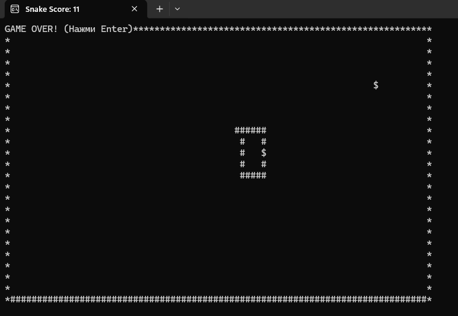

A classic **Snake** game implementation focused on algorithms and memory efficiency.
The project demonstrates how to handle game loops, collision detection, and coordinate systems in a console environment without external libraries.



---

### Key Features

### Algorithms & Logic
- **Efficient Data Structures:** Usage of `Queue<Point>` for the snake's body (FIFO) to ensure O(1) performance for movement.
- **Rendering Optimization:** No screen flickering. Usage of `Console.SetCursorPosition` to redraw only changed pixels (head and tail).
- **Collision Detection:** Mathematical logic to detect wall hits and self-eating scenarios.

### Gameplay Mechanics
- **Dynamic Difficulty:** The snake moves faster with every eaten item (`Thread.Sleep` adjustment).
- **Score Tracking:** Real-time score display in the window title.
- **Responsive Controls:** Handling `Console.KeyAvailable` to ensure non-blocking input.

### Tech Stack
Language: C# 12
Framework: .NET 9.0
Concepts: Structs, Queues, Game Loop, Coordinate Systems.

### How to Run
Clone the repository.
Open Console-Snake.sln in Visual Studio.
Press F5.
---

## Project Structure

```text
Console-Snake/
├── SnakeGame/
│   ├── Point.cs        # Struct for coordinates (Value Type optimization)
│   ├── Snake.cs        # Main logic (Queue management)
│   ├── Walls.cs        # Boundary logic
│   ├── FoodCreator.cs  # Random generation logic
│   └── Program.cs      # Game Loop & State Management
